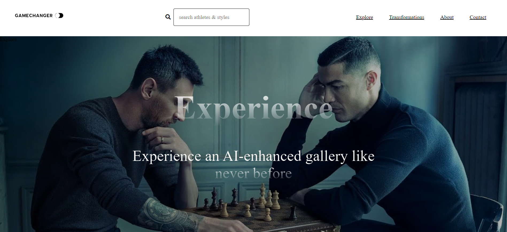
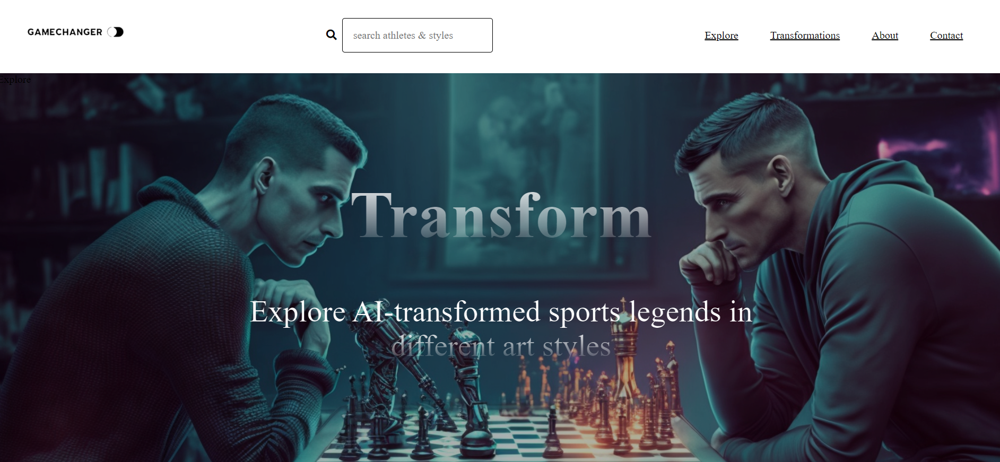
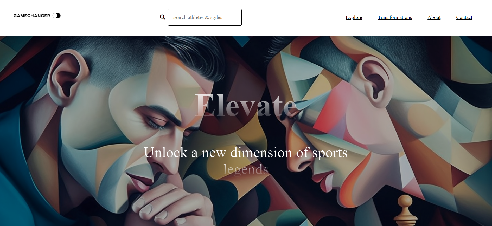
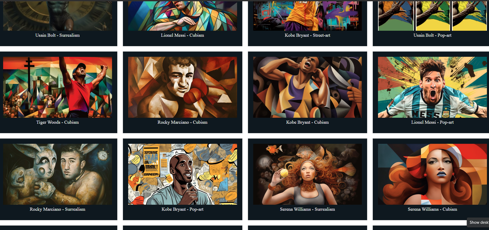
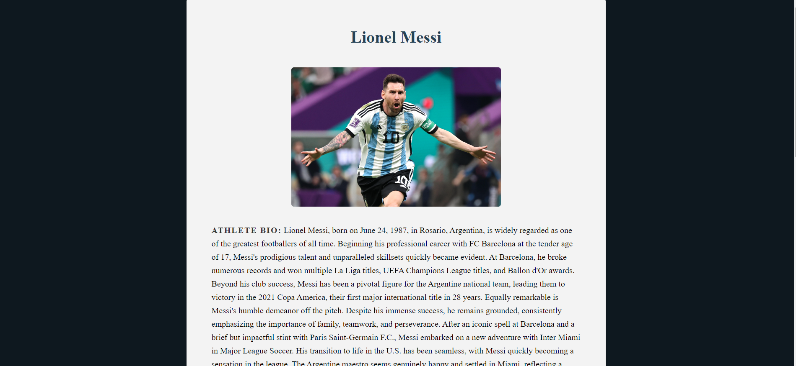

# Sports Art Gallery

Sports Art Gallery is a web-based gallery that offers a unique experience to sports enthusiasts by showcasing images of sports legends transformed using the Midjourney Discord bot. This project combines sports, art, and technology, providing a captivating platform for exploring sports legends through AI-powered image manipulation techniques.

## Features

- **Explore**: Dive deep into the world of sports legends and discover captivating artworks showcasing their achievements and iconic moments. Navigate through various artworks and learn more about the athletes.

- **Transformations**: Witness artistic representations of sports legends through various styles, offering fresh perspectives on their legacies.

- **Athlete Details**: Access comprehensive information about each athlete, including their biography, birthdate, nationality, and achievements.

- **Search**: Search for specific athletes or styles. Enter keywords to quickly find relevant artworks. (Status: Incomplete)

- **Latest Transformation**: View random transformations of sports legends. (Status: Incomplete)

- **Explore Section**: Explore AI-transformed athletes in various art styles like realism, minimalism, futurism, and more. (Status: Incomplete)

## Screenshots

### Homepage/Banner

### Gallery

### Athlete Bio

## Installation

1. Clone the repository:
   🌐 [Github Repository](https://github.com/DarinHajou/Sports_Art_Gallery.git)

2. Navigate to the project directory: `cd Sports-Art-gallery`

3. Open the desired index.html page in your preferred web browser.

## Dependencies

Sports Art Gallery relies on:

- **Font Awesome**: An iconic font and CSS toolkit.
- **Sanity**: A headless content management system (CMS).

Ensure you have an internet connection to load the required dependencies.

## Contributing

Contributions are welcome! If you encounter issues, have suggestions, or want to add features, submit a pull request. Follow the project's code of conduct and guidelines.

## Future Improvements

1. **Expand on the Concept**: Add more athletes and art styles to enhance user engagement.
2. **Complete Athlete Details**: Provide a comprehensive biography section for better insights into the athletes' backgrounds and achievements.
3. **Implement a Filter System**: Let users sort artworks based on criteria like athlete, sport, or artistic style.
4. **Enhance Search**: Improve search functionality with real-time suggestions.
5. **Introduce Pixel-to-Pixel Mouse Slide Effect**: Allow a smooth transition between the original and transformed image versions on mouse hover.

## License

Created strictly for academic and personal development purposes, this project isn't meant for commercial applications. As a student at Høyskolen i Kristiania in Oslo, this project doesn't carry any specific license.

## Contact

Darin H. Hajou  
📧 [Email Me](mailto:It.related@hotmail.com)
🌐 [Github Repository](https://github.com/DarinHajou/Sports_Art_Gallery.git)
🔗 [Github Projects](https://github.com/users/DarinHajou/projects/10)
🎨 [Sanity Deploy](https://sportsart.sanity.studio/)
🚀 Netlify Hosting (Deployment is a work in progress)
✉️ For inquiries, feedback, or suggestions.
